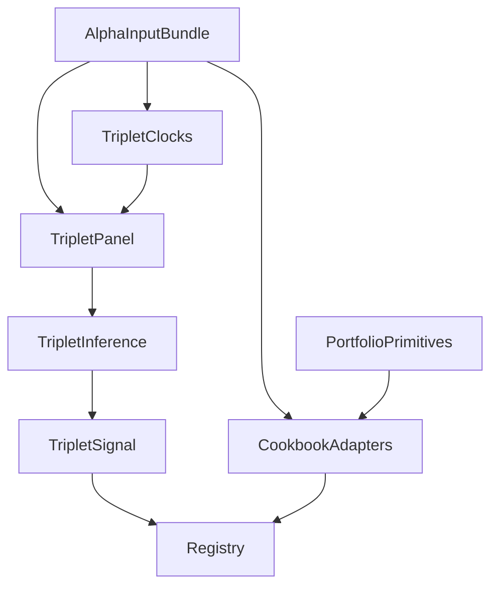

# Triplets And FX Cookbook Blueprint

## Ideate Handoff

Chosen approach: implement general triplet and portfolio operators as reusable `mechanical_alpha` modules, then expose only thin standalone alpha entries through the existing registry.

Load-bearing assumptions:

- `AlphaInputBundle` remains the canonical public data seam.
- The existing registry is an index only and can list implemented and blocked alpha modules.
- FX-specific strategies must not be translated into corporate-bond alphas without point-in-time inputs and explicit PI decisions.
- Gate 3 and Gate 4 truth outputs remain inaccessible to alpha code.

## Blueprint Handoff



| Module | Responsibility | Knows About | Doesn't Know About | Changes When |
| --- | --- | --- | --- | --- |
| `mechanical_alpha.triplets.clocks` | Build adapted clock indexes | timestamps, event counts, activity scores | strategy selection, portfolio construction | clock definitions change |
| `mechanical_alpha.triplets.panel` | Build lag-anchor-horizon panels | sampled state, target transforms | multiplicity, weights | target definitions change |
| `mechanical_alpha.triplets.inference` | Estimate and select triplets | Spearman estimates, adjusted p-values | source files, portfolio weights | selection statistics change |
| `mechanical_alpha.triplets.signal` | Score frozen triplet components | frozen ranks, selected components | data loading, costs | score transform changes |
| `mechanical_alpha.triplets.evaluation` | Produce matched-clock diagnostics | signal/return pairs | simulator truth | diagnostic definitions change |
| `mechanical_alpha.fx_cookbook.common` | Shared portfolio primitives | signal vectors, volatility, beta, bounds | alpha fitting, data ingestion | portfolio math changes |
| `mechanical_alpha.fx_cookbook.*` | Source-literal strategy functions and blocked adapters | cookbook formula, required inputs | canonical runner internals | strategy formula or data support changes |
| `mechanical_alpha.registry` | Index standalone alpha modules | alpha ids, module paths, status | formulas | alpha availability changes |

DAG check: PASS

Entry point: ideate

## Design Handoff

```python
from typing import Protocol
import pandas as pd

class TripletFitter(Protocol):
    def fit(self, panel: pd.DataFrame) -> object: ...

class TripletScorer(Protocol):
    def score(self, state: pd.DataFrame, fitted: object) -> pd.DataFrame: ...

class PortfolioPrimitive(Protocol):
    def __call__(self, signal: pd.Series, *args: object, **kwargs: object) -> pd.Series: ...
```

Approach: Dataclasses

```text
bond_alpha/src/mechanical_alpha/
├── triplets/
│   ├── __init__.py
│   ├── clocks.py
│   ├── panel.py
│   ├── inference.py
│   ├── signal.py
│   └── evaluation.py
├── fx_cookbook/
│   ├── __init__.py
│   ├── common.py
│   ├── momentum.py
│   ├── carry.py
│   ├── value.py
│   ├── rates_momentum_spillover.py
│   ├── coffee.py
│   ├── cftc_continuation.py
│   └── cftc_reversal.py
└── registry.py
```

Testing strategy:

- Unit tests cover math primitives and blocked strategy statuses.
- Triplet fixtures cover continuation, reversal, spread sign, and future-data mutation.
- Registry tests verify no second registry is introduced.

Source-review checkpoint path: `bond_alpha/docs/alpha/05_triplets_fx_cookbook_source_review.md`

