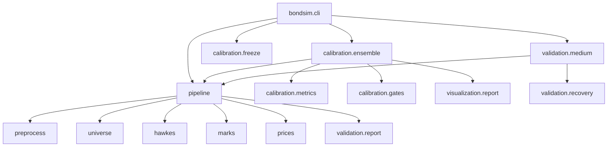

# Architecture Review Report

**Project:** MechanicalAlpha / bond_alpha  
**Date:** 2026-08-30  
**Files reviewed:** 62 Python files plus configs, tests, and Gate 3 prompt  
**Overall health:** 🟡 Adequate

## Codebase Summary

The repository now has two related packages. `bondsim` builds and validates synthetic corporate-bond event data. `mechanical_alpha` defines portable alpha contracts, labels, state, features, and baseline models. The structure is usable and test-covered, but several Gate 2.5 and Gate 3 controls still live in orchestration code instead of hardened artifact-verification modules.

## Verification

| Check | Command | Result |
|---|---|---|
| Regression tests | `conda run -n MechanicalAlpha python -m pytest -q` | PASS, 57 passed |
| Compile check | `conda run -n MechanicalAlpha python -m compileall src tests` | PASS |
| Smoke pipeline | `conda run -n MechanicalAlpha python -m bondsim pipeline --config configs/controlled_all.yaml --mode smoke --force` | PASS |

## Ranked Findings

| Rank | ID | Severity | Area | Finding |
|---:|---|---|---|---|
| 1 | CR-SPEC-001 | High | Gate 3 freeze rule | Gate 3 only checks that `frozen_calibration_id` is non-empty. It does not load `models/frozen/<id>`, verify checksums, verify source fingerprint, verify config hash, report software deviations, or record the frozen ID in every output manifest. Evidence: `src/bondsim/cli.py:104`, `src/bondsim/validation/medium.py:31`. |
| 2 | CR-SPEC-002 | High | Frozen bundle integrity | `freeze_calibration` does not verify the source run checksum file before freezing. It also overwrites `models/frozen/<id>` if it already exists, which weakens immutability. Evidence: `src/bondsim/calibration/freeze.py:23`, `src/bondsim/calibration/freeze.py:55`. |
| 3 | CR-SPEC-003 | High | Frozen artifacts | Freeze creates placeholder `artifact.json` files for model components rather than copying actual fitted liquidity, activity, Hawkes, mark, fair-value, OU, impact, lead-lag, thresholds, bins, and category artifacts. Evidence: `src/bondsim/calibration/freeze.py:37`. |
| 4 | AR-BND-001 | Medium | Boundary quality | `src/bondsim/pipeline.py` is a broad orchestrator that owns discovery, fitting, simulation, count calibration, report writing, validation, and smoke report aggregation. This raises change risk when adding Gate 3 locking or full-scale streaming. |
| 5 | AR-DEP-001 | Medium | Dependency direction | Gate 3 validation imports simulator internals directly and constructs mutable configs inside nested loops. This couples validation to simulation mechanics and makes frozen-run enforcement harder. Evidence: `src/bondsim/validation/medium.py:43`. |
| 6 | CR-SPEC-004 | Medium | Gate 3 prompt compliance | `docs/GATE3_PROMPT.md` asks for `reports/gate3/*`, figure PNG/SVG/parquet/metadata, and `GATE3_DECISION.json`; the runtime still writes medium reports to `reports/` and `reports/medium_runs/`. Evidence: `src/bondsim/validation/medium.py:32`, `docs/GATE3_PROMPT.md`. |
| 7 | AR-DRY-001 | Medium | Knowledge duplication | Partition reading and hashing are duplicated across `pipeline.py`, `calibration/ensemble.py`, and validation code. This creates drift risk in reproducibility checks. |
| 8 | AR-ABS-001 | Medium | Abstraction fitness | Calibration run state is represented as nested dictionaries. `CalibrationRun`, `FrozenBundle`, `GateStatus`, and `ContentHashSet` deserve explicit types before Gate 3. Evidence: `src/bondsim/calibration/ensemble.py:49`. |
| 9 | AR-TST-001 | Medium | Testability | Reproducibility tests cover primitives, not the full CLI reproduce/compare/freeze contract. The end-to-end Gate 2.5 command was manually run, but not encoded as a smoke test marker. |
| 10 | CR-STAND-001 | Low | Environment lock | `requirements.lock` records `sklearn==1.9.0`, but the installable package is `scikit-learn`. This can mislead environment recreation. Evidence: `requirements.lock`. |
| 11 | AR-EXT-001 | Low | Extensibility | Visualization helper modules exist, but `visualization/report.py` still owns most plotting logic. Adding Gate 3's 20 locked figures will likely expand one large module unless split by figure family. |
| 12 | AR-PAR-001 | Low | Parallel readiness | Seed and scenario loops are sequential. That is fine for reference reproducibility, but medium/full runs need an explicit parallel execution mode with immutable inputs and isolated output roots. |

## Scorecard

| Dimension | Score | Key Finding |
|---|---|---|
| Boundary Quality | 🟡 Adequate | Domain packages are separated, but orchestration modules are too broad. |
| Dependency Direction | 🟡 Adequate | Core modules are mostly acyclic, but validation depends on simulator construction details. |
| Abstraction Fitness | 🟡 Adequate | Config uses Pydantic correctly; run artifacts need stronger domain types. |
| DRY And Knowledge Duplication | 🟡 Adequate | Hashing, partition discovery, and report paths should be centralized. |
| Extensibility | 🟡 Adequate | Adding factors is clean; adding locked Gate 3 controls requires several existing edits. |
| Testability | 🟡 Adequate | Unit coverage is good; CLI-level reproducibility needs automated smoke coverage. |
| Parallelisation Readiness | 🟡 Adequate | Deterministic sequential mode exists; isolated parallel mode is not formalized. |

## Dependency Graph

## Recommended Fix Ranking

1. Implement a `FrozenCalibrationBundle` loader/verifier and make Gate 3 depend on it.
2. Make freeze immutable by refusing to overwrite existing frozen bundles and verifying source checksums before copy.
3. Replace placeholder frozen component folders with real serialized artifacts or explicit manifest-backed references.
4. Move Gate 3 output to `reports/gate3/` and write `GATE3_DECISION.json`.
5. Centralize partition discovery, canonical content hashing, and report path policies.
6. Split Gate 3 visualization into effect-specific modules before adding the 20 required figures.
7. Add CLI integration tests for `calibration reproduce`, `compare`, and `freeze`.
8. Fix `requirements.lock` package names.

## Code Review Summary

### Standards

The code is readable and tests pass. The main standards issue is breadth: `calibration/ensemble.py` and `pipeline.py` contain orchestration, simulation setup, artifact handling, and reporting in one place. That is acceptable for a vertical slice, but it is becoming a maintenance risk.

### Spec

Gate 2.5 is operational and passed fatal gates. The Gate 3 prompt was patched. Runtime Gate 3 is not yet compliant with the new frozen-calibration rule. Treat that as the next required implementation step before any further Gate 3 run.
