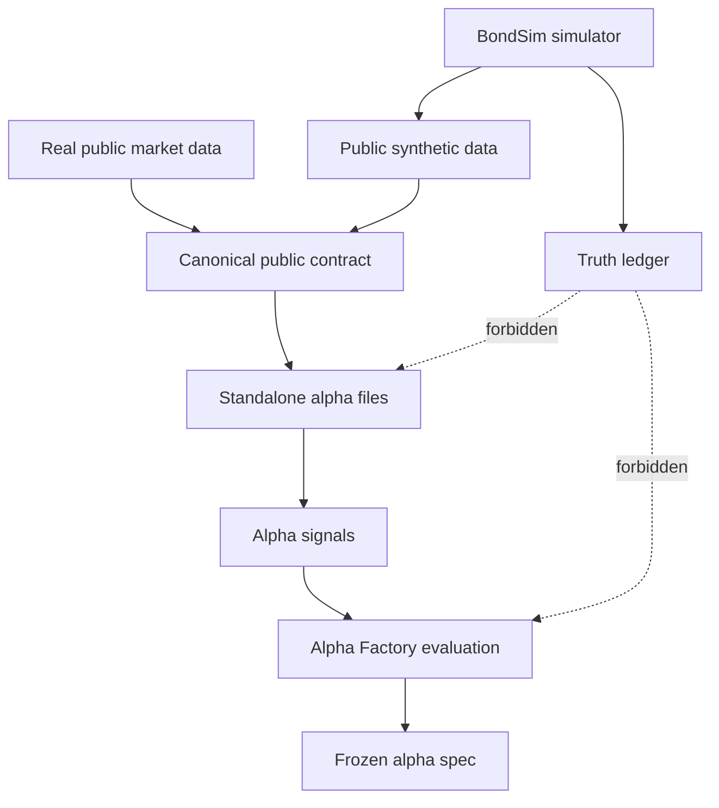
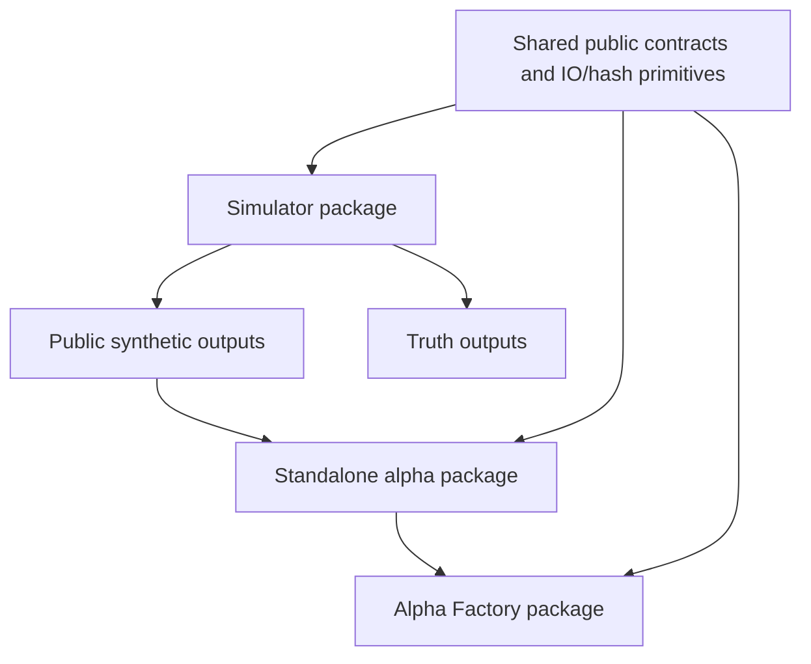

# Architecture Review Report

**Project:** MechanicalAlpha
**Date:** 2026-09-01
**Scope:** Decomposability between simulator code and bond alpha code
**Files reviewed:** 199 Python/test files under `bond_alpha/src` and `bond_alpha/tests`, plus package metadata and repo instructions
**Overall health:** 🟠 Weak

## Blueprint Baseline

The target architecture is a clean split between:

- `bondsim`: synthetic data generation, calibration, truth ledger, Gate 3/Gate 4 simulation workflows.
- `mechanical_alpha`: portable standalone alpha files, canonical input contracts, state/label helpers, and a small registry index.
- `bondalpha`: blinded alpha factory, frozen alpha specifications, public-data evaluation, and no simulator truth access.
- a future shared package, likely `bondkit` or `bondalpha_core`, containing only neutral primitives needed by both sides.

The key rule is simple: alpha code may read public synthetic or real canonical data, but it should not import simulator internals.

## Codebase Summary

The repository currently contains three related packages under one `pyproject.toml`: `bondsim`, `bondalpha`, and `mechanical_alpha`. `bondsim` owns simulator calibration, Hawkes simulation, price states, truth output, Gate 4 generation, and validation. `mechanical_alpha` owns portable standalone alpha files, alpha input contracts, label/state helpers, and the lightweight registry. `bondalpha` owns the Alpha Factory workflow, blinded Gate 4 evaluation, frozen alpha specs, and public synthetic dataset loading. The code is functional and well tested, but the packaging and import graph still couple alpha evaluation to simulator internals.

## Scorecard

| Dimension | Score | Key Finding |
|---|---:|---|
| Boundary Quality | 🟠 Weak | `bondalpha` mixes alpha evaluation with Gate 4 orchestration and simulator release flow. |
| Dependency Direction | 🔴 Critical | `bondalpha` imports `bondsim` directly in CLI, freeze, workflow, and blinded evaluation modules. |
| Abstraction Fitness | 🟡 Adequate | Standalone alpha files are good, but shared I/O/hash/json utilities are trapped inside `bondsim`. |
| DRY & Knowledge Duplication | 🟠 Weak | Public/truth guards, content hashes, and parquet/json writing exist in multiple packages or in the wrong owner. |
| Extensibility | 🟠 Weak | Adding a portable alpha still requires touching registry, docs/config, tests, and sometimes simulator-facing loaders. |
| Testability | 🟡 Adequate | Regression coverage is strong, but no packaging test proves alpha code can import without `bondsim`. |
| Parallelisation Readiness | 🟡 Adequate | Simulation has clear scenario/seed parallelism, but alpha and sim execution share one package boundary. |

## Domain Model

## Rate-of-Change Map

| Area | Change Rate | Reason |
|---|---|---|
| Public schema contracts | Moderate | Updated when real work-machine data mappings change. |
| Standalone alpha formulas | Moderate | Updated as research decisions settle. |
| Simulator DGP and truth schema | Structural | Updated only through calibration gates. |
| Gate 4 quarantine/release rules | Stable | These enforce blindness and should rarely change. |
| Shared hashes, JSON, parquet I/O | Stable | Utility behavior should be reused unchanged. |
| Reports and plots | Moderate | Output grows as research workflow matures. |
| CLI orchestration | Volatile | User-facing workflow continues evolving. |

## Architecture Findings

### AR-BND-001: `bondalpha` mixes alpha work with simulator workflow control

Evidence: `bond_alpha/src/bondalpha/workflow.py:12-15` imports `BondSimConfig`, `run_gate4`, `release_gate4_public`, and `verify_gate4_preconditions`.

Principle violated: Boundary quality / rate-of-change alignment.

Impact: The alpha factory cannot be cleanly moved to a work machine without bringing simulator Gate 4 orchestration with it.

Recommendation: Move cross-package Gate 4 orchestration to a top-level workflow module or keep it in `bondsim`; keep `bondalpha` limited to frozen alpha specs and public data evaluation.

### AR-DEP-001: Alpha package depends on simulator package utilities

Evidence:

- `bond_alpha/src/bondalpha/cli.py:28-30` imports `bondsim.config`, `bondsim.io`, and `bondsim.utils.hashing`.
- `bond_alpha/src/bondalpha/freeze.py:13-14` imports `bondsim.io` and `bondsim.utils.hashing`.
- `bond_alpha/src/bondalpha/blinded_gate4.py:32-33` imports `bondsim.io` and `bondsim.utils.hashing`.

Principle violated: Dependency direction.

Impact: `bondalpha` is not independently installable or cloneable.

Recommendation: Extract `write_json`, `write_parquet`, `file_sha256`, and `stable_json_hash` into a neutral shared package or duplicate the tiny utilities inside `bondalpha` until a shared package is justified.

### AR-DEP-002: One package metadata file installs simulator and alpha together

Evidence: `bond_alpha/pyproject.toml:21-24` exposes all three scripts, and `bond_alpha/pyproject.toml:38-40` includes `bondsim*`, `mechanical_alpha*`, `bondalpha*`, and `bond_alpha*`.

Principle violated: Dependency direction / packaging boundary.

Impact: A user cannot install only alpha code without simulator code using the current package definition.

Recommendation: Add package extras or split packaging into two installable distributions after imports are decoupled.

### AR-ABS-001: `AlphaInputBundle` is the right seam, but loader ownership is mixed

Evidence: `bond_alpha/src/mechanical_alpha/contracts.py:49-80` defines a clean public alpha bundle; `bond_alpha/src/mechanical_alpha/data/synthetic.py:15-63` is a simulator-specific adapter inside the alpha package.

Principle violated: Abstraction fitness.

Impact: The alpha package knows how simulator partitions are laid out.

Recommendation: Keep the canonical bundle in alpha code, but move simulator-specific conversion into either a thin optional adapter or a separate `adapters/synthetic_public.py` module clearly marked as optional.

### AR-DRY-001: Public/truth separation knowledge is duplicated

Evidence:

- `bond_alpha/src/mechanical_alpha/schema.py:104-122`
- `bond_alpha/src/bondalpha/access_guard.py:10-19`
- `bond_alpha/src/bondsim/outputs.py` has its own forbidden-public-column policy.

Principle violated: DRY / knowledge duplication.

Impact: A new truth column can be blocked in one package but leak through another.

Recommendation: Centralize public/truth schema policy in the alpha-facing contract package, and have simulator output validation import or generate from the same list.

### AR-EXT-001: Adding a new standalone alpha still causes shotgun edits

Evidence: Recent `BOND_CARRY_ROLLDOWN` required edits to alpha module, registry, config, docs, tests, and synthetic adapter.

Principle violated: Extensibility.

Impact: Portable alpha work remains mechanically correct but scattered.

Recommendation: Keep registry as an index, but add a documented alpha-template checklist and one optional metadata manifest per alpha file.

### AR-TST-001: No test proves alpha-only import independence

Evidence: Existing tests run with `pythonpath = ["src", "."]`, so they can import every local package together.

Principle violated: Testability.

Impact: Simulator imports can creep back into alpha code without a failing test.

Recommendation: Add an import-boundary test that scans `bondalpha` and `mechanical_alpha` imports and fails on disallowed `bondsim` imports, with a short allowlist for deliberate CLI/workflow bridge modules.

### AR-PAR-001: Scenario/seed parallelism is possible but not isolated at package boundary

Evidence: `bond_alpha/src/bondsim/pipeline.py:126-162` loops through sessions and events, while Gate 4 has scenario and seed orchestration in simulator modules.

Principle violated: Parallelisation readiness.

Impact: This is not blocking alpha portability, but package-level coupling makes it harder to run simulator generation and alpha evaluation as separate jobs.

Recommendation: Address package boundaries first; then parallelize by scenario/seed through a higher-level runner.

## Handoff

| Module | Responsibility | Knows About | Doesn't Know About | Changes When |
|---|---|---|---|---|
| `bondalpha_core` or `mechanical_alpha.core` | Public schemas, hash/json/parquet utilities, public/truth guard policy | Canonical public contracts | Simulator DGP, Gate truth, alpha formulas | Stable |
| `mechanical_alpha` | Standalone alpha formulas and registry index | Alpha inputs, signals, formula configs | Simulator calibration, Gate 4 truth, full workflow orchestration | Moderate |
| `bondalpha` | Alpha Factory research, freeze, blinded evaluation | Frozen alpha specs, public data, metrics | Simulator fitting internals, truth parameters | Moderate |
| `bondsim` | Simulator calibration, generation, truth, Gate workflows | DGP, truth ledger, frozen calibration | Alpha formulas and model fitting | Structural |
| `workflow` bridge | Optional end-to-end orchestration | Both package CLIs and manifests | Formula math and DGP internals | Volatile |

Abstraction decisions:

- Module: shared public contracts and hashing/I/O primitives.
- Package: `bondsim`, `mechanical_alpha`, and `bondalpha` as separately installable units.
- Function: standalone alpha `compute()` functions stay simple.
- Dataclass: alpha config objects remain local to each alpha file.
- Config: package-specific YAML stays separate.

Rate-of-change map:

- Stable: schemas, public/truth guards, content hashing, JSON/parquet writers.
- Moderate: alpha formulas, alpha configs, evaluation metrics.
- Volatile: CLI workflow commands and orchestration glue.
- Structural: simulator calibration, DGP, truth ledger.

DAG check: PASS

Entry point: direct
