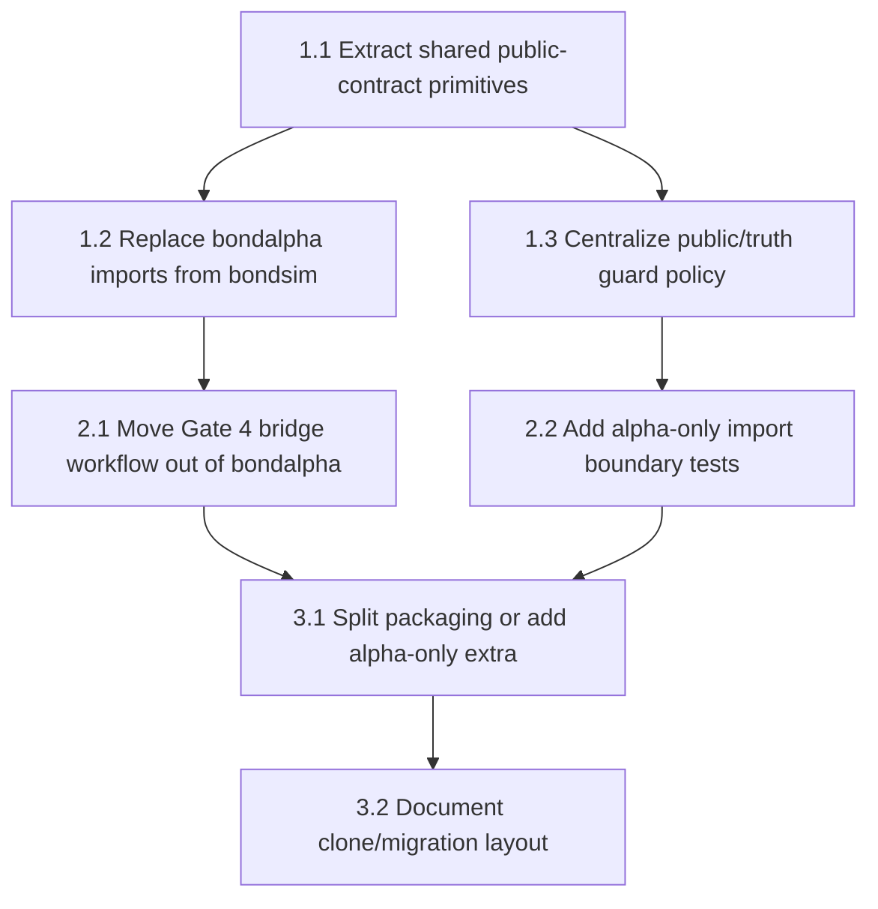

# Refactoring Roadmap

**Project:** MechanicalAlpha
**Date:** 2026-09-01
**Goal:** Make simulator code and bond alpha code decomposable.
**Findings consolidated:** 17

## Executive Summary

The alpha formulas are already mostly portable.

The main problem is not the alpha math. It is package coupling: `bondalpha` imports `bondsim`, shared safety rules live in several places, and one `pyproject.toml` packages simulator and alpha code together.

The clean path is to extract stable public-contract primitives first, then move Gate 4 orchestration out of the alpha package, then add import-boundary tests.

## Consolidated Findings

| Finding ID | Finding | Source | Severity | Dimension |
|---|---|---|---|---|
| AR-DEP-001 / CR-DEP-001 | `bondalpha.cli` imports simulator config, I/O, and hashing | architecture + code | 🔴 | Dependencies |
| AR-DEP-001 / CR-DEP-002 | `bondalpha.freeze` imports simulator I/O and hashing | architecture + code | 🟠 | Dependencies |
| AR-DEP-001 / CR-DEP-003 | `bondalpha.blinded_gate4` imports simulator I/O and hashing | architecture + code | 🟠 | Dependencies |
| AR-BND-001 / CR-BND-001 | `bondalpha.workflow` owns simulator Gate 4 orchestration | architecture + code | 🔴 | Boundaries |
| AR-BND-002 / CR-BND-002 | `mechanical_alpha.data.synthetic` knows simulator partition layout | architecture + code | 🟡 | Boundaries |
| AR-DRY-001 / CR-DRY-001 | Public/truth guard policy is duplicated | architecture + code | 🟠 | DRY |
| AR-DEP-002 / CR-ABS-001 | One package file installs simulator and alpha together | architecture + code | 🟠 | Packaging |
| AR-EXT-001 | New alphas require scattered edits | architecture | 🟡 | Extensibility |
| AR-TST-001 | No import-boundary test proves alpha-only independence | architecture | 🟠 | Testability |
| AR-PAR-001 | Scenario/seed parallelism is not isolated from package boundaries | architecture | 🟡 | Parallelisation |

## Dependency Graph

## Parallel Tracks

| Track | Steps | Theme | Can start immediately? |
|---|---|---|---|
| A | 1.1 → 1.2 → 1.3 | Shared primitives and safety policy | Yes |
| B | 2.1 | Move workflow bridge out of alpha package | After 1.2 |
| C | 2.2 → 3.1 → 3.2 | Enforce and document package split | After 1.3 |

## Phase 1: Untangle Shared Primitives

**Target:** Alpha packages no longer depend on simulator utilities.
**Effort:** Small to medium.

### Step 1.1: Extract shared I/O and hashing primitives

**Finding IDs:** AR-DEP-001, CR-DEP-001, CR-DEP-002, CR-DEP-003
**Priority score:** 5
**Scope:** multi-module
**Risk:** low

**What changes:**

- Move or copy `write_json`, `write_parquet`, `file_sha256`, and `stable_json_hash` into a neutral module.
- Candidate path: `bond_alpha/src/mechanical_alpha/io.py` and `bond_alpha/src/mechanical_alpha/hashing.py`.
- Update `bondalpha` imports to use neutral alpha-owned primitives.

**What doesn't change:**

- File formats.
- Checksum values for unchanged content.
- Public/truth output schemas.

**Verification:**

- [ ] `rg '^from bondsim' bond_alpha/src/bondalpha` no longer finds I/O/hash imports.
- [ ] `python -m pytest tests/alpha -q`
- [ ] `python -m pytest tests/test_gate4_generation.py tests/test_frozen_calibration_bundle.py -q`

**Depends on:** None
**Blocks:** Step 1.2, Step 2.1

**Rollback:** Revert only the import and shared utility move.

### Step 1.2: Centralize public/truth guard policy

**Finding IDs:** AR-DRY-001, CR-DRY-001, CR-SPEC-002
**Priority score:** 4
**Scope:** multi-module
**Risk:** medium

**What changes:**

- Create one canonical forbidden-column/path policy.
- Point `mechanical_alpha.schema`, `bondalpha.access_guard`, and `bondsim.outputs` at the same policy.

**What doesn't change:**

- Existing forbidden tokens remain forbidden.
- Gate 4 public/truth separation remains intact.

**Verification:**

- [ ] Existing public/truth separation tests pass.
- [ ] Add one test proving a new forbidden token fails in alpha and simulator validation.
- [ ] `python -m pytest tests/test_mechanical_alpha_contract.py tests/alpha/test_access_guard.py tests/test_gate4_readiness.py -q`

**Depends on:** Step 1.1
**Blocks:** Step 2.2

**Rollback:** Revert policy imports to previous local constants.

## Phase 2: Move Bridge Workflow Out Of Alpha

**Target:** `bondalpha` evaluates frozen alpha specs on public data only.
**Effort:** Medium.

### Step 2.1: Move Gate 4 orchestration bridge

**Finding IDs:** AR-BND-001, CR-BND-001, CR-SPEC-001
**Priority score:** 5
**Scope:** multi-module
**Risk:** medium

**What changes:**

- Move `bondalpha.workflow` to a bridge location.
- Candidate path: `bond_alpha/src/bondsim/alpha_workflow.py` or `bond_alpha/src/mechanical_alpha_workflows/gate4_alpha.py`.
- Remove `bondsim` imports from `bondalpha.cli`.
- Keep `bondalpha evaluate-gate4` as an alpha-only command that requires already released public data.

**What doesn't change:**

- Gate 4 generation commands.
- Frozen alpha spec format.
- Blinded evaluation outputs.

**Verification:**

- [ ] `rg '^from bondsim|^import bondsim' bond_alpha/src/bondalpha` returns no matches.
- [ ] Gate 4 workflow tests are moved or renamed to target the bridge owner.
- [ ] `python -m pytest tests/alpha/test_blinded_gate4.py tests/alpha/test_blinded_workflow.py tests/test_gate4_generation_cli.py -q`

**Depends on:** Step 1.1
**Blocks:** Step 3.1

**Rollback:** Restore `bondalpha.workflow` and CLI imports.

### Step 2.2: Make synthetic public adapter explicitly optional

**Finding IDs:** AR-ABS-001, CR-BND-002
**Priority score:** 2
**Scope:** single-module
**Risk:** low

**What changes:**

- Rename or document `mechanical_alpha.data.synthetic` as a public synthetic adapter.
- Keep it alpha-safe.
- Add a real-data adapter placeholder only if it consumes `AlphaInputBundle`, not simulator internals.

**What doesn't change:**

- Current CLI behavior.
- `external_factors.parquet` support.

**Verification:**

- [ ] Existing CLI selected-alpha tests pass.
- [ ] Adapter test confirms no truth path is read.
- [ ] `python -m pytest tests/test_mechanical_alpha_contract.py tests/test_bond_carry_rolldown.py -q`

**Depends on:** Step 1.2
**Blocks:** Step 3.2

**Rollback:** Keep current module name and add only documentation.

## Phase 3: Make The Split Enforceable

**Target:** A future clone can install or copy alpha code without simulator code.
**Effort:** Medium.

### Step 3.1: Add import-boundary tests

**Finding IDs:** AR-TST-001, CR-SPEC-001
**Priority score:** 4
**Scope:** single-module
**Risk:** low

**What changes:**

- Add a test that blocks `bondsim` imports inside `bondalpha` and core `mechanical_alpha`.
- Allow only explicitly named bridge modules if needed.

**What doesn't change:**

- Runtime behavior.
- Alpha formulas.

**Verification:**

- [ ] Boundary test fails before Step 2.1 and passes after Step 2.1.
- [ ] `python -m pytest tests/test_package_boundaries.py -q`

**Depends on:** Step 2.1
**Blocks:** Step 3.2

**Rollback:** Remove the boundary test if it blocks emergency work, then re-add after the bridge is moved.

### Step 3.2: Split packaging or add alpha-only install path

**Finding IDs:** AR-DEP-002, CR-ABS-001
**Priority score:** 3
**Scope:** cross-cutting
**Risk:** medium

**What changes:**

- Option A: create separate pyproject files for simulator and alpha.
- Option B: keep one pyproject but add clear extras and packaging docs.
- Preferred first move: add alpha-only packaging docs after import boundaries are clean.

**What doesn't change:**

- Existing `bondsim`, `bondalpha`, and `mechanical-alpha` commands in the current repo.
- Existing tests.

**Verification:**

- [ ] Alpha-only import smoke test in a temporary environment or with `PYTHONPATH` limited to alpha/shared paths.
- [ ] `python -m pytest -q`

**Depends on:** Step 3.1
**Blocks:** Step 3.3

**Rollback:** Keep monorepo packaging and document copy paths.

### Step 3.3: Document the migration unit

**Finding IDs:** AR-EXT-001, AR-PAR-001
**Priority score:** 2
**Scope:** single-module
**Risk:** low

**What changes:**

- Add `docs/alpha/portable_alpha_package.md`.
- Document exactly which paths move to the work machine.
- Document which paths must not move, especially `bondsim` truth and synthetic truth directories.

**What doesn't change:**

- Code behavior.
- Package names.

**Verification:**

- [ ] Paths in doc exist.
- [ ] Docs say how to run one alpha, a subset, and all alphas.

**Depends on:** Step 3.2
**Blocks:** None

**Rollback:** Remove or revise the doc.

## Expected Outcome

| Dimension | Before | After Expected |
|---|---:|---:|
| Boundary Quality | 🟠 | 🟢 |
| Dependency Direction | 🔴 | 🟢 |
| Abstraction Fitness | 🟡 | 🟢 |
| DRY & Knowledge Duplication | 🟠 | 🟢 |
| Extensibility | 🟠 | 🟡 |
| Testability | 🟡 | 🟢 |
| Parallelisation Readiness | 🟡 | 🟡 |

## What This Plan Does Not Address

- It does not rewrite alpha formulas.
- It does not split the git repository immediately.
- It does not run Gate 4 again.
- It does not change frozen Gate 3 or Gate 4 artifacts.
- It does not change the simulator DGP.

## Handoff

Phase count: 3.

Step count: 6.

Risk summary:

- Low risk: 3 steps.
- Medium risk: 3 steps.
- High risk: 0 steps.

Recommended first execution slice:

1.1 Extract shared I/O and hashing primitives.

1.2 Centralize public/truth guard policy.

3.1 Add import-boundary tests.

This first slice gives the highest payoff because it makes future alpha-only migration measurable.
