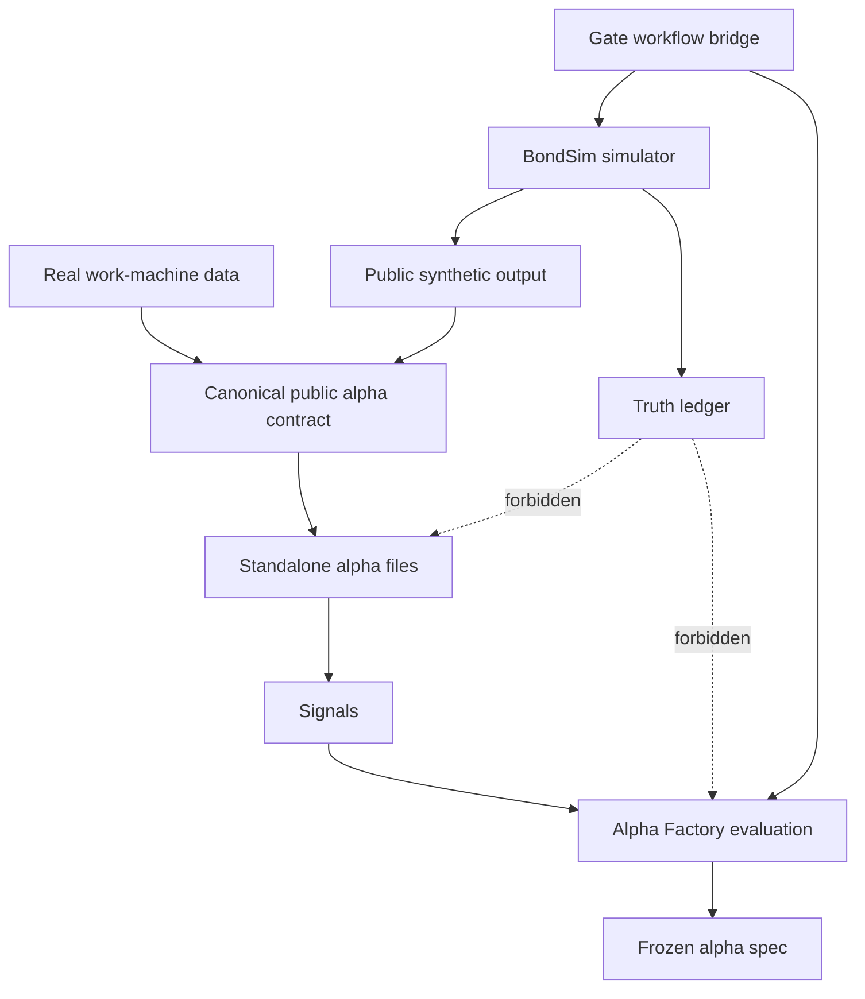
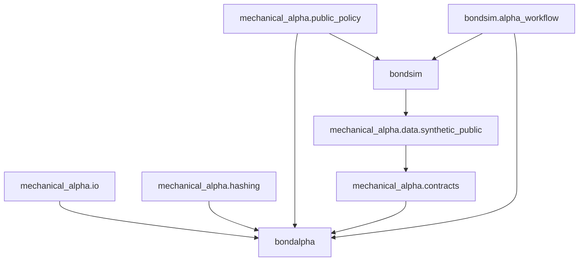
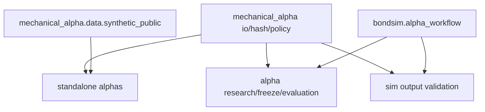

# Alpha/Simulator Decomposition Scaffold Handoff

**Project:** MechanicalAlpha
**Date:** 2026-09-01
**Input plans:**

- `reviews/2026_09_01_alpha_sim_decomposition_architecture_review.md`
- `reviews/2026_09_01_alpha_sim_decomposition_code_review.md`
- `reviews/2026_09_01_alpha_sim_decomposition_refactoring_plan.md`

## Ideate

### Problem Frame

The goal is to make alpha code portable without breaking the simulator, Gate 3/Gate 4, or blinded evaluation.

The current blocker is dependency direction.
`bondalpha` imports `bondsim` for config, parquet/json writing, hashing, and Gate 4 workflow orchestration.

### Approaches Considered

| Approach | Description | Main Upside | Main Risk |
|---|---|---|---|
| Minimal shared primitives | Extract only public I/O, hashing, and guard policy into neutral `mechanical_alpha` modules. | Fastest path to alpha-only portability. | Leaves one monorepo package file for later cleanup. |
| Full package split now | Create separate installable distributions for simulator, alpha core, and alpha factory. | Strongest long-term boundary. | High blast radius across CLI, tests, imports, and packaging. |
| Bridge-first split | Move Gate 4 orchestration out of `bondalpha` first, then extract shared primitives. | Removes the most visible mixed workflow. | Still leaves utility imports tangled during the transition. |

### Stress Test: Loading Assumptions

| Assumption | Failure Mode | Defense |
|---|---|---|
| Alpha code only needs public canonical tables. | Real work-machine data uses different storage layout. | Keep `AlphaInputBundle` as the canonical seam and put storage-specific loading in adapters. |
| Public synthetic and real canonical data can share one contract. | Simulator public data lacks fields present in real data. | Optional tables stay optional; availability metadata records missing fields. |
| `bondalpha` can stop importing `bondsim`. | CLI currently needs simulator helpers. | Move JSON/parquet/hash helpers to neutral modules first. |
| Truth guards can be centralized. | A simulator-only truth field gets missed by alpha guards. | One forbidden policy module is imported by simulator and alpha validation. |
| Gate 4 orchestration does not belong in alpha package. | Existing command users rely on `bondalpha blinded-workflow`. | Keep compatibility wrapper temporarily, but make bridge owner outside alpha. |
| Alpha-only cloning is the near-term requirement. | Packaging split is delayed. | Add import-boundary tests now; packaging split can follow without formula changes. |

### Decision Summary

Chosen approach: Extract neutral public-contract utilities first, then move mixed Gate 4 workflow out of `bondalpha`, then enforce the boundary with tests.

Key trade-off accepted: Keep the monorepo packaging for one more slice while removing the import coupling that blocks alpha-only portability.

Load-bearing assumptions:

- `AlphaInputBundle` remains the portable data seam.
- `bondalpha` should not import `bondsim` after the first slice.
- Gate 4 bridge orchestration may import both packages, but formula and alpha evaluation code may not.
- Public/truth guard policy must be shared, not duplicated.
- Existing simulator outputs and frozen artifacts must remain byte/content compatible where relevant.

First thing to build: Neutral `mechanical_alpha` modules for public I/O, hashing, and public/truth policy, plus import-boundary tests.

Extensibility vector: When the code moves to the work machine, only `mechanical_alpha`, `bondalpha`, alpha configs, and docs need to move.

## Architect

### Domain Model



### Module Decomposition

| Module | Responsibility | Knows About | Doesn't Know About | Changes When |
|---|---|---|---|---|
| `mechanical_alpha.io` | Stable JSON/parquet read-write helpers for public artifacts. | Paths, DataFrames, compression defaults. | Simulator DGP, alpha formulas, truth semantics. | Stable |
| `mechanical_alpha.hashing` | Stable file and JSON/content hashing. | Serializable payloads and file bytes. | Simulation scenarios, alpha models. | Stable |
| `mechanical_alpha.public_policy` | Canonical public/truth path and column guard policy. | Forbidden path tokens, forbidden column tokens, source-ID tokens. | How simulator creates truth. | Stable |
| `mechanical_alpha.contracts` | Canonical alpha input bundle and source metadata. | Public schemas, optional tables, availability metadata. | Simulator partition internals. | Moderate |
| `mechanical_alpha.data.synthetic_public` | Optional adapter from public synthetic partitions to `AlphaInputBundle`. | Public simulator partition layout only. | Truth roots, simulator calibration, planted parameters. | Moderate |
| `bondalpha` | Alpha research, freeze, blinded public-data evaluation. | Frozen alpha specs, public bundles, alpha metrics. | Simulator internals and truth ledgers. | Moderate |
| `bondsim` | Simulation, calibration, Gate 4 generation, truth. | DGP, truth, frozen calibration, generation manifests. | Alpha formula internals. | Structural |
| `bondsim.alpha_workflow` | Temporary bridge for end-to-end Gate 4 + alpha workflow. | Simulator CLI contracts and alpha CLI contracts. | Alpha formulas and simulator DGP internals. | Volatile |

### Rate-of-Change Map

| Area | Rate |
|---|---|
| Public/truth guard tokens | Stable |
| JSON/parquet/hash utilities | Stable |
| Alpha formulas and configs | Moderate |
| Public synthetic adapter | Moderate |
| Gate workflow bridge | Volatile |
| Simulator DGP and truth ledger | Structural |

### Abstraction Decisions

| Object | Abstraction |
|---|---|
| Public artifact writer | Function |
| Content hasher | Function |
| Public/truth guard | Function |
| Canonical alpha bundle | Dataclass |
| Synthetic public adapter | Module |
| Gate workflow bridge | Module |
| Boundary policy for loaders | Protocol |
| YAML config shape | Config |

DAG check: PASS

Entry point: ideate

## Design

### Objective

Make `bondalpha` cloneable and runnable against public canonical data without importing simulator internals.

### Core Abstraction

The core abstraction is the public alpha contract.

It is the stable boundary between data producers, standalone alphas, and evaluation.

### Component Wiring



### Data Flow

1. `bondsim` writes public synthetic outputs and truth outputs into physically separate roots.
2. `mechanical_alpha.data.synthetic_public` reads public outputs only.
3. The adapter creates an `AlphaInputBundle`.
4. `mechanical_alpha.alphas.*` compute standalone signals from the bundle.
5. `bondalpha` evaluates and freezes specs using public data only.
6. `bondsim.alpha_workflow` may orchestrate both sides, but is not imported by alpha formula code.

### Key Interfaces

```python
from __future__ import annotations

from pathlib import Path
from typing import Any, Iterable, Protocol

import pandas as pd


class PublicDatasetAdapter(Protocol):
    """Loads public observable data into the canonical alpha contract."""

    def load(self, root: Path) -> Any:
        """Return an alpha input bundle from a public-only data root."""
        ...


class PublicArtifactWriter(Protocol):
    """Writes deterministic public artifacts without simulator dependencies."""

    def write_json(self, payload: dict[str, Any], path: Path) -> Path:
        """Write a JSON artifact and return its path."""
        ...

    def write_parquet(self, frame: pd.DataFrame, path: Path, compression: str = "zstd") -> Path:
        """Write a parquet artifact and return its path."""
        ...


class PublicAccessPolicy(Protocol):
    """Validates that alpha code sees public data only."""

    def assert_public_path(self, path: Path) -> None:
        """Raise if the path points to truth or quarantined truth data."""
        ...

    def assert_no_forbidden_columns(self, columns: Iterable[str]) -> None:
        """Raise if columns expose truth, latent state, or source identifiers."""
        ...
```

### Config Design

Approach: Pydantic

Keep existing external YAML configs.

Add only small config keys when needed:

- `paths.public_root`
- `paths.output_root`
- `access_policy.forbidden_path_tokens`
- `access_policy.forbidden_column_tokens`
- `access_policy.source_identifier_columns`
- `adapters.synthetic_public.enabled`

Do not introduce new third-party dependencies.

### File Structure For Scaffold

```text
bond_alpha/
├── src/
│   ├── mechanical_alpha/
│   │   ├── io.py
│   │   ├── hashing.py
│   │   ├── public_policy.py
│   │   └── data/
│   │       └── synthetic_public.py
│   └── bondsim/
│       └── alpha_workflow.py
├── tests/
│   ├── test_public_artifact_primitives.py
│   ├── test_public_access_policy.py
│   └── test_package_boundaries.py
└── docs/
    └── alpha/
        └── portable_alpha_package.md
```

### Scaffold Instructions

1. Create `mechanical_alpha.io` by moving stable equivalents of `bondsim.io.write_json` and `bondsim.io.write_parquet`.
2. Create `mechanical_alpha.hashing` by moving stable equivalents of `bondsim.utils.hashing.file_sha256` and `bondsim.utils.hashing.stable_json_hash`.
3. Create `mechanical_alpha.public_policy` with one forbidden path/column/source-ID policy.
4. Update `bondalpha` imports to use `mechanical_alpha.io` and `mechanical_alpha.hashing`.
5. Point `bondalpha.access_guard`, `mechanical_alpha.schema`, and `bondsim.outputs` at `mechanical_alpha.public_policy`.
6. Move mixed Gate 4 workflow ownership from `bondalpha.workflow` to `bondsim.alpha_workflow`.
7. Keep a compatibility shim in `bondalpha.workflow` only if existing tests or CLI commands require it.
8. Add import-boundary tests that fail on `bondsim` imports under `bond_alpha/src/bondalpha`, except explicit compatibility shims.
9. Add docs that define the alpha-only migration unit.

### Tests To Run After Scaffold

```bash
cd bond_alpha
python -m pytest tests/test_public_artifact_primitives.py tests/test_public_access_policy.py tests/test_package_boundaries.py -q
python -m pytest tests/alpha -q
python -m pytest -q
```

## Handoff

```text
bond_alpha/
├── src/
│   ├── mechanical_alpha/
│   │   ├── io.py
│   │   ├── hashing.py
│   │   ├── public_policy.py
│   │   └── data/
│   │       └── synthetic_public.py
│   └── bondsim/
│       └── alpha_workflow.py
├── tests/
│   ├── test_public_artifact_primitives.py
│   ├── test_public_access_policy.py
│   └── test_package_boundaries.py
└── docs/
    └── alpha/
        └── portable_alpha_package.md
```

```python
from __future__ import annotations

from pathlib import Path
from typing import Any, Iterable, Protocol

import pandas as pd


class PublicDatasetAdapter(Protocol):
    """Loads public observable data into the canonical alpha contract."""

    def load(self, root: Path) -> Any:
        """Return an alpha input bundle from a public-only data root."""
        ...


class PublicArtifactWriter(Protocol):
    """Writes deterministic public artifacts without simulator dependencies."""

    def write_json(self, payload: dict[str, Any], path: Path) -> Path:
        """Write a JSON artifact and return its path."""
        ...

    def write_parquet(self, frame: pd.DataFrame, path: Path, compression: str = "zstd") -> Path:
        """Write a parquet artifact and return its path."""
        ...


class PublicAccessPolicy(Protocol):
    """Validates that alpha code sees public data only."""

    def assert_public_path(self, path: Path) -> None:
        """Raise if the path points to truth or quarantined truth data."""
        ...

    def assert_no_forbidden_columns(self, columns: Iterable[str]) -> None:
        """Raise if columns expose truth, latent state, or source identifiers."""
        ...
```

Approach: Pydantic

Dependency graph:



Testing strategy:

- Unit test `mechanical_alpha.io`, `mechanical_alpha.hashing`, and `mechanical_alpha.public_policy`.
- Boundary test `bond_alpha/src/bondalpha` for disallowed `bondsim` imports.
- Regression test all alpha tests after import changes.
- Full regression test from `bond_alpha` after scaffold implementation.
